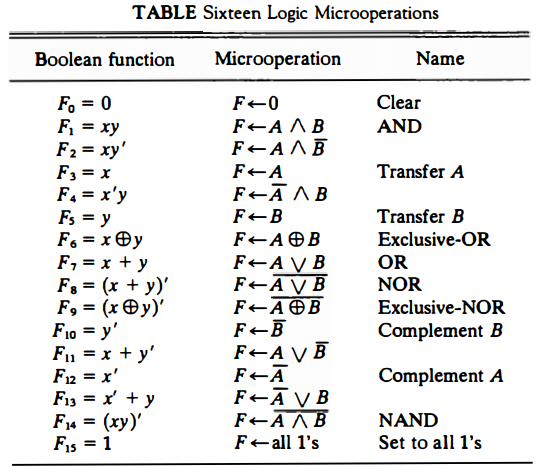
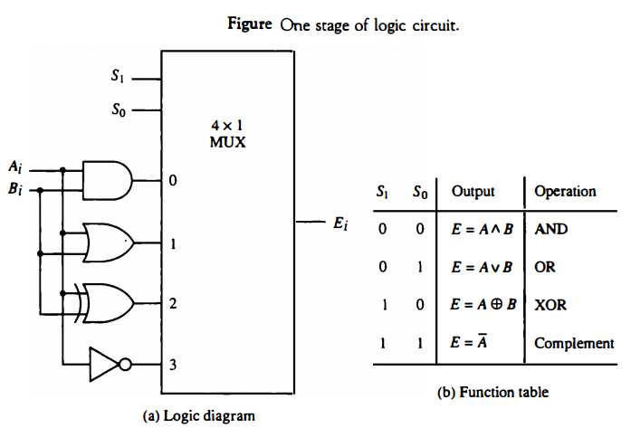
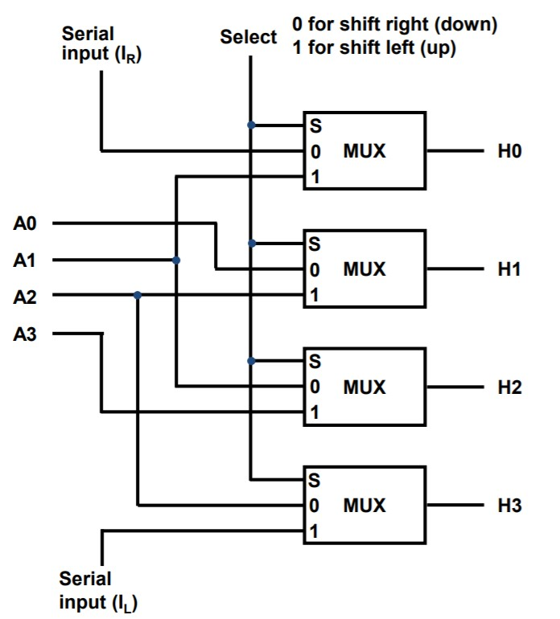
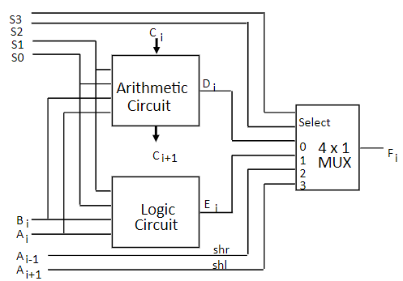
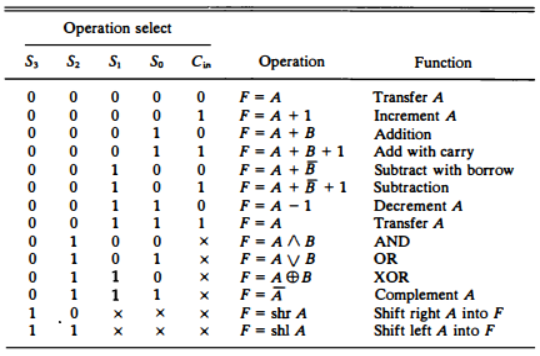

# CSA Chapter 4: 레지스터 전송과 마이크로 연산
### 1. 레지스터 전송언어(Register Transfer Language)
- 마이크로 연산(Micro-operation)
	- 레지스터에 저장된 데이터를 가지고 실행되는 동장
	- 하나의 clock시간 동안 실행되는 기본동작(Shift, count, clear, load)
- 레지스터 전송언어
	- 마이크로 연산, 전송을 간단하고 명로하게 표시하기 위하여 사용하는 기호
	- 디지털 컴퓨터의 내부 조직을 상세하게 나타내는 수단으로 사용
	- 디지털 시스템의 설계 편의성 제공
- 레지스터 전송 언어 규칙
	- 대문자로 표시(MAR, MBR, AC, PC, DR ...)
		> Memory Address Register, Memory Buffer Register, Program Counter, Data Register
	- 레지스터 가장 왼쪽 FF(Flip Flop) --> MSB 가장 오른쪽 --> LSB
	- 16비트 PC레지스터의 경우,
		- 상위(8~15) : PC(H)
		- 하위(0~7) : PC(L)
### 2. 레지스터 전송(Register Transfer)
- 레지스터 정보 전송
	- 치환(replacement) 연산자 사용  
		R2 <-- R1
		> <-- : 전송
	- 제어 조건이 있을 경우,  
		if(P=1) then (R2 <-- R1)
	- 제어 함수로 표현할 경우,  
		P : R2 <-- R1  
		> ': 앞'은 조건': 뒤'는 조건이 참일경우 실행
		R2에는 t+1타이밍에 전송 완료
- 레지스터 전송의 기본 기호
	- Register data exchange  
		T : R2 <-- R1, R1 <-- R2
		> , : 좌우 둘다 수행
### 3. 버스와 메모리 전송(Bus and Memory Transfers)
> 버스란 신호들이 지나다니는 통로
- 공통버스(Common Bus)
	- 레지스터들 사이의 전송 통로
	- 한 번에 하나의 신호만 전송하도록 제어
	- 멀티플렉서를 사용하여 레지스터 선택  
		> 이러한 멀티플렉서의 그룹을 Bus Controller(버스 제어기)라고 함

	(레지스터 전송문으로 표현 예)  
	BUS <-- C, R1 <-- BUS  
	:EQ R1 <-- C
- 3-상태 버퍼(3-state Buffer)
	- 멀티플렉서 대신 사용하여 버스 구성 가능
	- 3개의 상태로 동작
		- 논리 0, 논리 1 : 정상적인 버퍼로 동작
		- 고저항 상태(high-impedance) : 출력 차단
- 메모리 전송
	- Read : DR <-- M[AR]
		> M[AR] = 메모리의 특정 address
	- Write : M[AR] <-- R1
### 4. 산술 마이크로 연산(Arithmetic Microoperations)
- 마이크로 연산의 분류
	- 레지스터 전송 마이크로 연산 : 레지스터 간 이진 정보 전송
	- 산술 마이크로 연산 : 수치 데이터에 대한 산술 연산
	- 논리 마이크로 연산 : 비수치 데이터에 대한 비트 조작 연산
	- 시프트 마이크로 연산 : 데이터에 대한 시프트 연산
- 산술 마이크로 연산
	> R1 + R2(plus)  
	R1 - R2(minus)  
	R2'(complement:1의 보수)  
	R2' + 1(negate:2의보수)  
	R1 + R2' + 1(subtraction:감산)  
	R1 + 1(Increment)  
	R1 - 1(Decrement)
- 이진 가산기
	- 두 비티와 이진 캐리의 산술합을 계산
	- 여러 개의 전가산기를 연결
- 이진 감가산기
	- 보수를 만드는 게이트와 신호 사용
		> M --> 0 : 가산  
		M --> 1 : 감산
	- A(0-3), B(0-3), S(0-3)는 bus에 연결
- 산술 회로
	- 4개의 전가산기
	- 4개의 멀티플렉서
	- 2개의 4비트 입력(A, B)
	- 1개의 출력(D)
	- 3개의 제어 라인(S1, S0, Cin)
### 5. 논리 마이크로 연산(Logis Microoperations)

- 논리 마이크로 연산의 하드웨어 구현

### 6. 시프트 마이크로 연산(Shift Microoperations)
- 논리 시프트
	- 직렬 입력으로 0이 전송  
	R1 <-- shl(R1)
	R2 <-- shr(R2)
		> shift-left, shift-right
- 순환 시프트
	- 직렬 출려이 직렬 입력으로 전송
	- cir, cil
		> circular shift-left, circular shift-right
- 산술 시프트
	- 부호 비트를 제외하고 시프트
	- 왼쪽 시프트: x2
	- 오른쪽 시프트: /2
- 4비트 조합회로 시프터
	- 하드웨어 구현

### 7. 산술 논리 시프트 장치(Arithmetic-Logic Shift Unit)

> Table 위에서부터 8개 항목을 arithmetic circuit 에서 처리  
> 다음 4개의 항목을 logit circuit에서 처리  
> 마지막 2개의 시프트 항목은 Ai+1, Ai-1에서 제어
