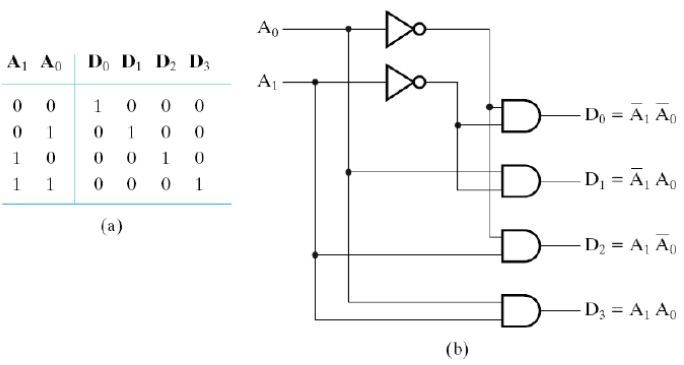
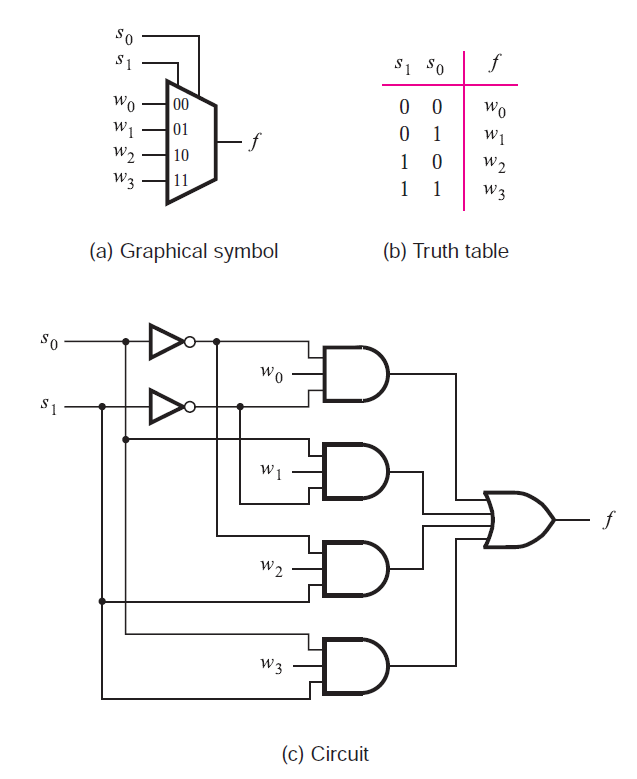

# CSA Chapter2 : 디지털 부품(Digital Components)

### 1. 집적회로(Intergrated Circuits)
- 정의
	- 디지털 게이트를 구성하는 전자 부품을 포함하는 실리콘 반도체 칩(Chip)
	- 칩 내부에 게이트들이 연결되고, 외부로도 연결
	- 칩의 등록 번호로 구분(dataBook을 통하여 정보 확인 가능)
- 집적 규모에 따른 분류
	- SSI : 소규모, 10개 이하의 게이트들로 구성
	- MSI : 중규모, 10~200개의 게이트들로 디코더, 가산기, 레지스터 구현
	- LSI : 대규모, 200~1,000개의 게이트들로 프로세서나 메모리 칩과 같은 디지털 시스템 형성
	- VLSI : 초대규모, 수천개 이상의 게이트 집적, 대형 메모리나 마이크로컴퓨터 칩 구성
		> ex) 마이크로 프로세서(CPU)
- 디지털 논리군
	- TTL : Transistor-Transistor Logic
		- 일반 로직 회로부품
			> 게이트 단위로 구성된 회로
	- ECL : Emitter-Coupled Logic
		- 고속 논리 시스템용 부품(1~2ns 이하), 슈퍼컴픁터용
			> TTL 대비 '게이트 딜레이'가 매우 짧음 부품 but 비용이 매우 높음
			>> 게이트 딜레이 : 입력부터 출력까지 걸리는 시간
	- MOS : Metal Oxide Semicondutor
		- 고밀도 집적회로용 부품
			> BJT 대비 집적도가 높음  
			> p-type, n-type MOSFET 2가지 방식이 존재
	- CMOS : Complement Metal Oxide Semiconductor
		- 고밀도 회로, 단순한 제조공정, 저전력 특성
			> nMOSFET 과 pMOSFET을 결합하여 각 소자의 단점을 상쇄
### 2. 디코더(Decoders)
- N 비트의 이진 정보를 서로 다른 2^n개의 원소 정보로 출력
	> N개의 입력을 넣으면 2^n개의 출력중 한개의 출력만 선택되어 나오게 됨
	- 2개의 입력 --> 4가지(2^2) 출력 : 2x4 decoder
	- 3개의 입력 --> 8가지(2^3) 출력 : 3x8 decoder
	
- NAND 게이트로 이루어진 디코더
	- 보수화 된  출력이 더 경제적임
	- 대부분의 출력신호가 1로 유지
	- CMOS회로의 영향으로 저전력 회로에 유리
- 인코더
	- 디코더와 반대 동작 수행
	- 2^n의 입력에 대해서 N이진 코드 출력
	- 한번에 하나의 입력만이 1의 값을 가질 수 있음

### 3. 멀티플렉서(Multiplexers)
- 정의
	- N개의 선택 입력에 따라서 2^n개의 출력을 하나의 출력에 선택적으로 연결
	- 다중 입력 중 하나를 선택하여 출력으로 연결
	- 네크워크 스위치(전화, LAN, WAN)의 기본 구조 요소
	
	> 입력은 고정된 상태에서 셀렉터(S)에 의해서 제어
### 4. 레지스터(Registers)
- 레지스터의 구성
	- N비트 레지스터 : N비트의 이진 정보 저장
	- N개의 플립플롭과 조합 회로로 구성
- 기본 레지스터
	> 단순히 여러개의FF을 병렬적으로 연결한 구성  
	> FF의 이름은 출력값을 사용
	- 클럭펄스 타이밍에 입력값이 레지스터에 저장
		> 클럭펄스 타이밍 : 클럭이 상승 또는 하강하는 지점
	- 레지스터에 저장된 값은 항상 출력에서 참조 가능
		> 레지스터는 항상 출력을 내보내는 상태
	- Clear, Clock입력 제공
- 병렬로드 가능한 4비트 레지스터
	> Clock pulse가 입력되더라도 Load값이 1이 아니라면, 변경된 값이 저장되지 않음  
	> 즉, Load값을 통해 데이터 저장을 제어할 수 있음
	- 4비트의 데이터를 동시에 입력 가능
	- Load, Clock입력 제공
### 5. 시프터 레지스터(Shift Registers)
- 정의
	- 레지스터에 저장된 이진 정보를 단방향/양방향으로 이동 가능한 레지스터
	- 각 FF들의 입력이 출력과 cascade로 연결
	- 공통의 clock이 다음 상태로의 이동 제어
- 병렬로드를 가지는 양방향 시프트 레지스터(General Register)
	- 병렬로드, 왼쪽/오른쪽 시프트, 병렬출력 가능
	- 동기화된 clock에 의하여 동작
	- 범용 레지스터를 지칭

### 6. 이진 카운터(Binary Counters)
- 이진 카운터
	> 레지스터의 변형된 형태
	- 정해진 순서대로 상태 변이 수행
		> 0, 1, 2, 3 ... 등의 형태로 순차적으로 상태변이를 수행  
		> 상태 = 출력값
	- Clock, 또는 외부 입력에 따른 상태 변이
	- 용도
		- 사건의 발생 횟수 카운트
		- 동작 순서 제어 타이밍 신호 발생에 적용
- 병렬입력을 가진 이진 카운터
	- 카운터의 초기값 설정 가능
	- 병렬 입력을 통하여 초기값 로드
	- Load, Clear, Increment 가능

### 7. 메모리 장치(Memory Unit)
- 정의
	- 정보의 입출력 기능을 가지는 저장 요소들의 집합
	- Word단위로 정보를 저장
	- Word : 입출력에서 하나의 단위로 취급되는 비트의 그룹
		> 한번에 읽고 써지는 데이터 크기
		- 16bit컴퓨터 : 레지스터/메모리 버스의 크기가 16bit(2byte)
		- 64bit컴퓨터 : 레지스터/메모리 버스의 크기가 64bit(8byte)
	- Byte : 워드의 기본 단위
	- MB(10^6byte), GB(10^9byte), PB(10^12byte)
- RAM(Random Access Memory)
	> random 하게 access하더라도 모두 동일한 access time을 가진다
	- Word의 물리적인 위치에 관계 없이 데이터 접근
	- 모든 데이터 위치에 대하여 동일한 접근 시간
	- N비트의 입력/출력(word 크기와 동일)
	- K개의 주소 라인으로 2^k개 word중 하나를 선택
		> 2^k의 주소중 특정 주소에 접근하기 위해서는 k개의 주소라인이 필요(memory addressing)  
		> memory addressing의 기능은 decoder의 동작과 유사(n개의 입력 --> 2^n개의 출력중 한개를 선택)
	- 읽기/쓰기 지정(R/W)
- ROM(Read Only Memory)
	- 한 번 저장된 데이터를 읽기만 가능
	- 1 word가 N비트이고 M워드를 저장하는 N x M ROM
	- ROM에 저장된 M word를 접근할 수 있는 K개의 주소입력(2^k = M)
- ROM의 종류
	- Mask ROM : 석판화(Lithography)방식으로 구워져 나오는 ROM
		> 반도체 생산단계에서 저장됨
	- PROM : 한번만 프로그램 가능
	- EPROM : UV에 의한 데이터 삭제(ROM초기화) 및 재프로그래밍 가능
	- EEPROM : 전기 신호에 의한 데이터 삭제/초기화 및 재프로그래밍
- ROM의 기능을 하는 RAM
	- Flash-RAM : BIOS, USB memory, SD card
	- NV-RAM
		- Non-VolatileRAM
		- Battery Backup RAM
