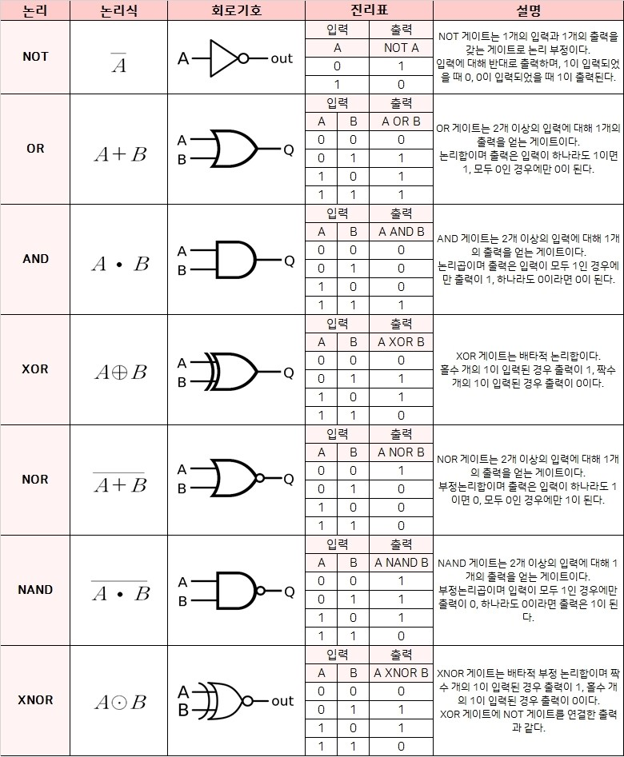
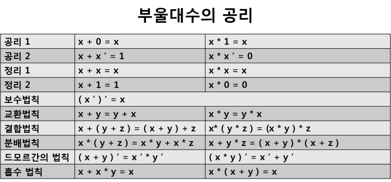
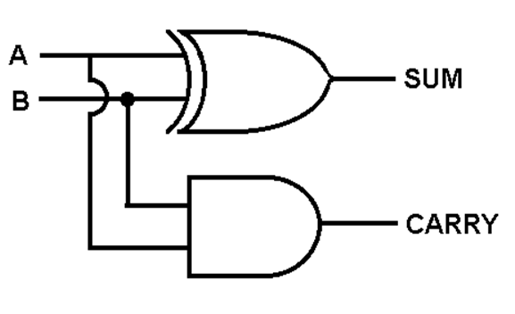
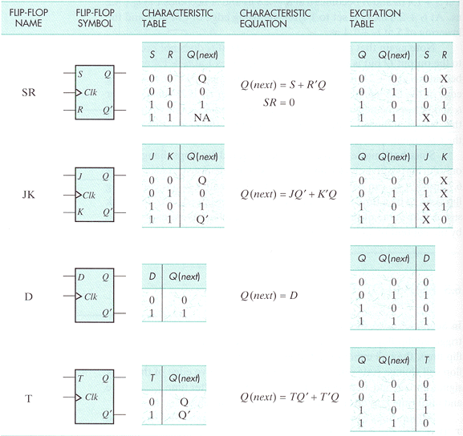

# CSA Chapter1 디지털 논리회로

### 1. 디지털 컴퓨터(Digital Computer)
- 정의
	- 이진 시스템을 사용하여 계산을 수행하는 디지털 시스템
	- 비트의 그룹을 사용하여 숫자, 문자 및 기타 정보를 표시하거나 처리
- 컴퓨터 하드웨어
	- CPU : 중앙처리장치
		- 컴퓨터 그 자체로 정의
		- 산술 논리 처리와 데이터의 저장, 제어 기능 수행
	- 주변장치 : 메모리(RAM/ROM), 저장장치(Storage), 입출력 장치(I/O devices)
- 컴퓨터 소프트웨어
	- 운영체제
	- 시스템 프로그램
		- OS에 포함되거나 연결되어 시스템 운영을 보조
	- 응용프로그램

### 2. 논리 게이트(Logic Gates)
- 이진 정보의 표시
	- 0과 1의 전압 신호
	- 일반적으로 0 = 0V / 1 = 5V 를 표시함
	- 경우에 따라 0.5V - 3V 시스템에 대응하기도 함
- 논리 게이트
	- 기본 게이트
	- 진리표로 동작 정의  

### 3. 부울 대수(Boolean Algebra)
- 이진 변수와 논리 동작을 취급하는 대수
- 기본 대수 동작 : AND, OR, NOR
- 부울 대수의 예
	- F = x + y'z
	> `+` : OR gate 논리합  
	`*` : AND gate 논리곱  
	`'` : NOT gate 논리부정
- 부울 대수의 사용 이유
	- 변수 사이의 **진리표** 관계를 **대수적**으로 표시
	- **논리도**의 입출력 관계를 **대수 형식**으로 표시
	- 같은 기능을 가진 더 간단한 회로 발견
- 부울 대수의 기본 관계
	- 항등원
	> 임의의 원소에 연산한 결과가 자기자신이 나오게 만드는 원소
	- 역원
	> 임의의 원소에 연산할 결과가 항등원이 나오게 만드는 원소
	- 교환법칙
	- 결합법칙
	- 드모르간의 정리  

- 부울 대수의 간략화와 등가 회로
	- F = ABC + ABC' + A'C = AB(C + C') + A'C = AB + A'C
	> 동일한 동작을 하는 등가회로이지만 왼쪽은 게이트 수가 6개 오른쪽은 게이트 수가 4개
	>> 게이트 수를 줄여 코스트를 줄일 수 있음
- 부울 대수의 보수
	- F = AB + C'D' + B'D
	- F' = (A' + B')(C + D)(B + D')

### 4. 맵의 간소화(Karnaugh Map)
- 맵 방식의 부울 수식 간소화
	- 부울 함수를 visual diagram을 통하여 간소화
	- Karnaugh map, Veitch diagram
	> - 카르노맵의 각변과 꼭지점은 붙어있는 것으로 인식
	> - 각 항들은 중복해서 묶을 수 있음
	> - 항을 묶을 때는 2의 제곱 순으로 묶어야 함
	- Minterm, Maxterm을 이용한 간소화
- 논리합의 논리곱
	- 1항의 간소화
	> - 일반적으로 카르노 맵의 간소화 방식으로 1을 이용함
	> - Sum of product(논리합의 논리곱) 형태
	- 0항의 간소화
	> - 0항으로 간소화 했을 경우, 원함수의 보수이므로 결과에 NOT을 취해줘야 한다
	> - Product of sums(논리곱의 논리합) 형태
- 무정의 조건(Don't Care Condition)
	- 사용하지 않는 항을 활용하여 간소화

### 5. 조합회로(Combinational Circuit)
- 정의
	- 입력과 출력을 가진 논리 게이트의 집합
	- 출력의 값은 입력의 0, 1의 조합에 의하여 결정되는 함수의 결과로 표시
	- n개의 입력 조합이 있을 경우 가능한 입력 조합 : 2^n가지
	> 각 입력은 '1'과 '0' 2가지를 가지기 때문
- 조합 회로의 설계 절차
	1. 해결할 문제의 제시
	1. 입력과 출력의 변수에 문자 기호 부여
	1. 입력-출력 관계를 정의하는 진리표 도출
	1. 각 출력에 대한 간소화된 부울 함수 도출
	1. 부울 함수에 대한 논리도 작성
	1. 논리도를 바탕으로 회로 구현
- 반가산기(Half adder)  

	- 2개의 비트값을 산술적으로 가산  
	S = x'y + xy' = x ⊕ y  
	C = xy
	> S : 합(sum)  
	C : 올림수(carry)
- 전가산기(Full adder)  

	- 캐리값을 포함하여 3비트 가산  
	S = x ⊕ y ⊕ z  
	C = xy + (x ⊕ y)z

### 6. 플립플롭(Flip-Flop)
- 플립플롭의 정의
	- 1비트의 디지털 정보를 저장하는 이진 셀(디지털 메모리)
	- 동기식 순차회로의 기본적인 요소로 사용, 조합회로와 함께 순차회로를 구성
	- 입력의 상태가 변화를 일으키기 전까지는 이전의 출력 상태를 그대로 유지
- 플립플롭의 종료
	> 출력 단에 Q와 Q'이 같이 존재한다  
	> 입력의 변화가 있더라도 클럭(C)이 들어올 경우에만 출력(Q)이 변화(동기화)한다
	- SR - 플립플롭
	- D - 플립플롭
	- JK - 플립플롭
	- T - 플립플롭  

- 모서리-변이형 플립플롭(Edge-triggered FF)
	- 입력값의 변화 모서리에서만 동작
		- Upward triggered FF
			- 입력값이 상향일 경우에만 동작(0 -> 1)
		- Downward triggered FF
			- 입력값이 하향일 경우에만 동장(1 -> 0)
	- 올바른 동작을 위해서는 최소의 신호 유지 시간 필요
		- Setup time
			- 출력 변화를 위하여 입력이 유지되어야 하는 최소 시간
		- Hold time
			- 출력 유지를 위하여 입력이 바뀌지 않아야 하는 최소 시간

### 7. 순차회로(Sequential Circuit)
- 정의
	- 플립플롭과 게이트(또는 조합회로)를 서로 연결한 회로
	- 클럭펄스에 의하여 동기화된 입력 순찰에 의하여 제어
	- 출력은 외부 입력과 플립플롭의 현 상태의 함수로 표시
	> 회로 구조상 플립플롭의 출력이 입력으로 들어가 현상태를 반영한다
- 플립플롭의 입력식
	- FF의 입력을 만들어내는 조합 회로 부분
	- 부울 수식에 의하여 표현
	- 상태표(State Table)
	- 상태도(State Diagram)
- 순차회로의 설계 예
	- 2비트 2진카운터의 설계
		1. 상태표, 상태도 작성
		1. 순차회로 여기표 작성
		1. 플립플롭의 선택과 입력식 도출
		1. 회로도 구현
