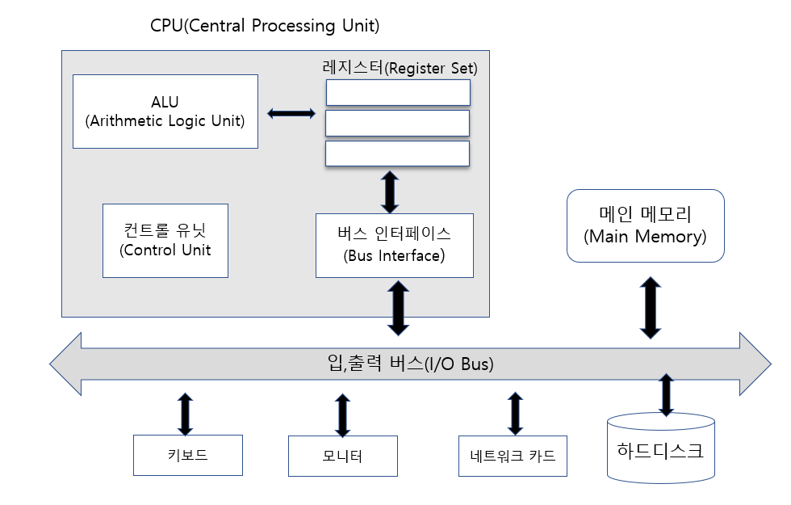
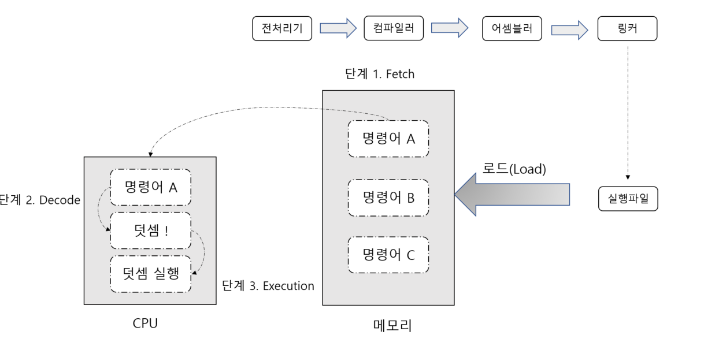

# Systemp Programming Chapter1
### 1. 시스템 프로그램의 이해와 접근
- 시스템 프로그래밍이란?
	- 시스템(컴퓨터 시스템)의 범위
		- 하드웨어+운영체제
	- 시스템 프로그래밍
		- 컴퓨터 시스템을 활용하는 소프트웨어 개발
		- Windows 운영체제 자체의 기능을 십분 활용하는 프로그래밍
			> 응용 프로그램에 필수적으로 포함되는 요소
	- 응용 소프트웨어 개발과의 차이점
		- 시스템 프로그래밍은 모든 응용 프로그램에 포함되는 요소
- 컴퓨터 시스템의 주요 구성요소
	- CPU, 캐쉬
		- 컴퓨터 하드웨어 구조
- 운영체제
	- 메인 메모리
		- 메모리 관리 기법
- 하드디스크
	- 파일 I/O(다양한 I/O포함)

### 2. 컴퓨터 하드웨어의 구성

- CPU(Central Processing Unit)
	- 중앙처리장치
	- 연산이 이뤄지는 원리는 무엇인가?
- 메인 메모리(Main Memory)
	- 램(RAM)
	- 프로그램 실행 방식을 이해하는 것
- 입출력 버스(input/output bus)
	- 데이터 송 수신이 이뤄지는 원리
### 3. CPU에 대한 이해
- ALU
	> 연산을 담당하는 요소
- 컨트롤 유닛
	> CPU전체에 신호를 주어 제어, 관리하는 요소  
	> 명령어를 해석하는 요소
- 레지스터
	> 연속적인 데이터를 처리하기 위해 임시적으로 저장하는 공간
- 버스 인터페이스
	> 입출력 버스를 통한 통신규약에 대한 이해를 통해 데이터를 주고 받는 장치
- 클럭 신호(Clock Pulse)
	- 동작 타이밍
		- 클럭 방생기의 클럭
	- 필요성
		- 요소들의 동기화

### 4. 프로그램의 실행과정
> 전처리기 --> 컴파일러 --> 어셈블리 --> 링커
- 전처리기에 의한 치환 작업
	- #으로 시작하는 지시자
- 컴파일러에 의한 번역
	- CPU의 명령어로 번역
- 어셈블러에 의한 바이너리 코드 생성
	- CPU의 명령어를 바이너리 코드로 번역
- 링커에 의한 연결과 결합
	- 라이브러리와의 결합
- Stored Program Concept

	> 폰 노이만 : 메모리에 저장되는 방식으로 컴퓨터 구조가 구성되어야 한다고 주장
	- Fetch
		- CPU내부로 명령어 이동
	- Decode
		- 명령어 해석
		- 컨트롤 유닛
	- Execution
		- 연산을 진행
		- 보통은 ALU를 생각

### 5. 하드웨어 구성의 재접근
- 데이터 이동의 기반 버스 시스템
	- 데이터 버스
		- 데이터 이동
- 어드레스 버스
	- 주소 이동
- 컨트롤 버스
	- 컨트롤 신호 이동
