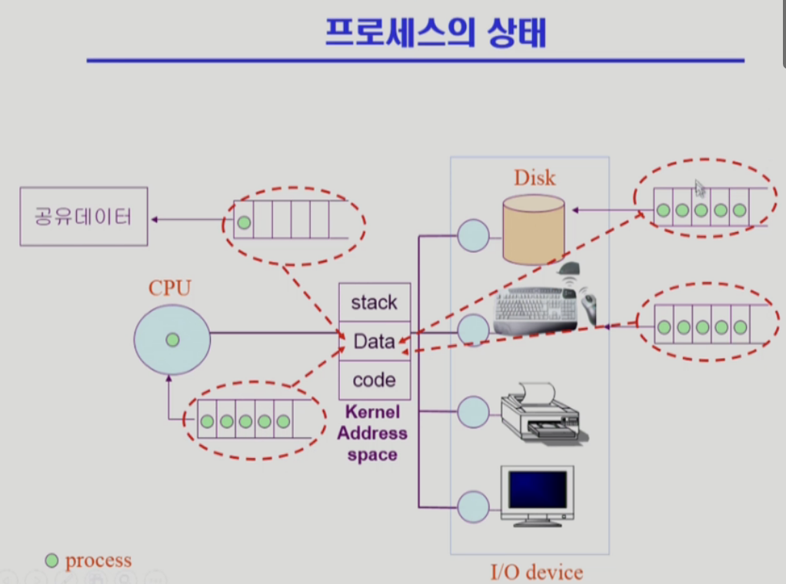
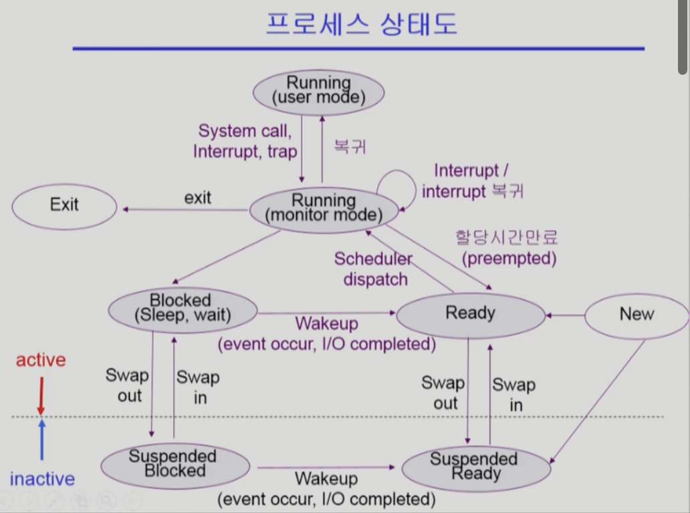
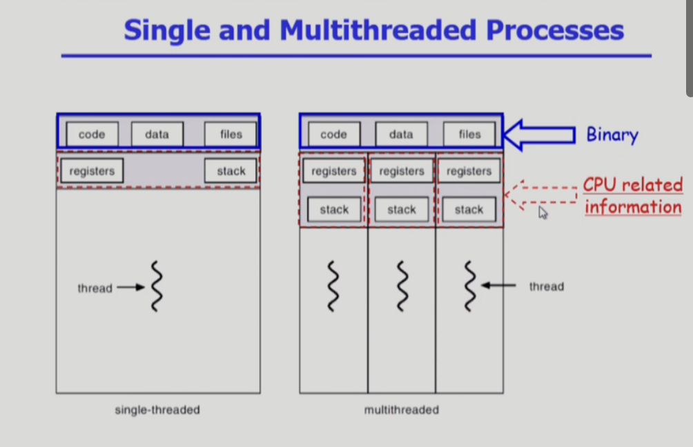

# Operating System Chapter 3 : Process
### 1. 프로세스의 개념
- **"Process is a program in execution"**
- 프로세스의 문맥(context)
	> 현재 시점에 프로세스 진행상태를 규명할 수 있게 함
	>> CPU가 프로세스를 한번에 수행하지 않기 때문에 백업용으로 필요함
	- CPU 수행 상태를 나타내는 하드웨어 문맥
		- Program Counter
		- 각종 register
	- 프로세스의 주소 공간
		- code, data, stack
	- 프로세스 관련 커널 자료 구조
		- PCB(Process Control Block)
		- Kernel stack
### 2. 프로세스의 상태(Process State)
> CPU가 하나밖에 없는 시스템으로 가정
- 프로세스는 상태(state)가 변경되며 수행된다
	- Running
		- CPU를 잡고 instruction을 수행중인 상태
	- Ready
		- CPU를 기다리는 상태(메모리 등 다른 조건을 모두 만족하고)
	- Blocked(wait, sleep)
		- CPU를 주어도 당장 instruction을 수행할 수 없는 상태
		- Process 자신이 요청한 event(예 : I/O)가 즉시 만족되지 않아 이를 기다리는 상태
		- (예) 디스크에서 file을 읽어와야 하는 경우
	- Suspended (stopped)
		- 외부적인 이유로 프로세스의 수행이 정지된 상태
		- 프로세스는 통째로 디스크에 swap out된다
		- (예) 사용자가 프로그램을 일시 정지시킨 경우(break key) 시스템이 여러 이유로 프로세스를 잠시 중단시킴(메모리에 너무 많은 프로세스가 올라와 있을 때)
		> Blocked : 자신이 요청한 event가 만족되면 Ready  
		> Suspended : 외부에서 resume해 주어야 Active
	- New : 프로세스가 생성중인 상태
	- Terminated : 수행(execution)이 끝난 상태
### 3. 프로세스 상태도
		admitted		(timer)interupt		exit
	[New] ----------->> | R | <<------------------- | R | ------->> [Terminated]
			    | e |		        | u |
			    | a | ------------------->> | n |
			    | d |   scheduler dispatch  | n |
			    | y |		        | i |
			    |   |		        | n |
			    |   | <<--- [Waiting] <<--- | g |
				 I/O or		    I/O or
				event completion    event wait

> Suspended state가 추가된 버전

### 4. Process Control Block(PCB)
- PCB
	- 운영체제가 각 프로세스를 관리하기 위해 프로세스당 유지하는 정보
	- 다음의 구성 요소를 가진다(구조체로 유지)
		1. OS가 관리상 사용하는 정보
			- Process state, Process ID
			- scheduling information, priority
		2. CPU 수행 관련 하드웨어 값
			- Program counter, registers
		3. 메모리 관련
			- Code, data, stack 의 위치 정보
		4. 파일 관련
			- Open file descriptors ...

### 5. 문맥교환(Context Switch)
- CPU를 한 프로세스에서 다른 프로세스로 넘겨주는 과정
- CPU가 다른 프로세스에게 넘어갈 때 운영체제는 다음을 수행
	- CPU를 내어주는 프로세스의 상태를 그 프로세스의 PCB에 저장
		> 커널 주송공간의 data영역에 해당 PCB공간 할당
	- CPU를 새롭게 얻는 프로세스의 상태를 PCB에서 읽어옴
- System call 이나 Interrupt 발생시 반드시 context switch가 일어나는 것은 아님

		(1)
		[User mode] --------------->> [kernel mode] --------------->> [User mode]
		사용자 프로세스A       |      ISR or system call함수      |        사용자 프로세스A
		                   |                                 |
		                   |                                 |
		                   |                                 |
		       interrupt or system call           문맥교환 없이 user mode 복귀	

		(2)
		[User mode] --------------->> [kernel mode] --------------->> [User mode]
		사용자 프로세스A       |      ISR or system call함수      |        사용자 프로세스B
		                   |                                 |
		                   |                                 |
		                   |                                 |
		timer interrupt or I/O요청 or system call        문맥교환 일어남
	> (1)의 경우에도 CPU수행 정보 등 context의 일부를 PCB에 save해야 하지만 문맥교환을 하는 (2)의 경우 그 부담이 훨씬 큼(eg. cache memory flush)
### 6. 프로세스를 스케줄링하기 위한 큐
- Job queue
	- 현재 시스템 내에 있는 모든 프로세스의 집합
		> Ready queue, device queues에 있는 모든 프로세스 포함
- Ready queue
	- 현재 메모리 내에 있으면서 CPU를 잡아서 실행되기를 기다리는 프로세스의 집합
- Device queues
	- I/O deviec의 처리를 기다리는 프로세스의 집합
- 프로세스들은 각 큐들을 오가며 수행된다
### 7. 스케줄러(Scheduler)
- Long-term scheduler(장기 스케줄러 or job scheduler)
	- 시작 프로세스 중 어떤 것들을 ready queue로 보낼지 결정
	- 프로세스에 memory(및 각종 자원)을 주는 문제
	- degree of Multiprogramming을 제어
	- time sharing system에는 보통 장기 스케줄러가 없음(무조간 ready)
		> 일반적으로 사용하는 시스템에는 존재하지 않음
		>> 프로그램에 시작하면 무조건 바로 메모리에 올려놓음
- Short-term scheduler(단기 스케줄러 or CPU scheduler)
	- 어떤 프로세스를 다음번에 runnig 시킬지 결정
	- 프로세스에 CPU를 주는 문제
	- 충분히 빨라야 함(millisecond 단위)
- Medium-term scheduler(중기 스케줄러 or Swapper)
	> 중기 스케줄러가 존재함에 따라 suspended라는 새로운 process state가 생김
	- 여유 공간 마련을 위한 프로세스를 통째로 메모리에서 디스크로 쫒아냄
	- 프로세스에게서 memory를 뺏는 문제
	- degree of Multiprogramming을 제어
### 8. Thread
> 프로세스 1개에서 공유할 수 있는 것을 최대한 공유하면서 CPU사용단위로 분리한 것
>> CPU수행과 관련된 정보들만 분리해서 가지게됨(Stack, PC, registers)
- "A thresd (or lightweight process) is a basic unit of CPU utilization"
- Thread의 구성
	- program counter
	- register set
	- stack space
- Thread가 동료 Thread와 공유하는 부분(=tasl)
	- code section
	- data section
	- OS resources
- 전통적인 개념은 heavyweight process는 하나의 thread를 가지고 있는 task로 볼 수 있다
- 다중 스레드로 구성된 태스크 구조에서는 하나의 서버 스레드가 blocked(waiting)상태인 동안에도 동일한 태스크 내의 다른 스레드가 실행(running)되어 빠른 처리를 할 수 있다
- 동일한 일은 수행하는 다중 스레드가 협력하여 높은 처리율(throughput)과 성능 향상을 얻을 수 있다
- 스레드를 사용하면 병렬성을 높일 수 있다
	> CPU가 여러개 존재하는 시스템에서만 해당하는 사항
- 프로세스는 생성될 때마다 새로운 주소공간을 할당받아야 하므로 메모리가 낭비될 수 있지만 쓰레드를 사용하면 메모리 측면에서 이점을 얻을 수 있음
### 9. Single and Multithreaded Processes

### 10. Benefits of Thread
- Responsiveness
	- eg) multi-threaded Web
		- if one thread is blocked (eg network) another thread continues(eg display)
- Resource Sharing
	- n threads can share binary code, data, resource of the process
- Economy
	- creating & CPU switching thread(rather than a process)
	- Solaris의 경우 위 두가지 overhead가 각각 30배, 5배
		> solaris: linux계열
- Utilization of MP Architecture
	> processor가 여러개인 architecture 즉, cpu가 여러개인 시스템에만 해당
	- each thread may be running in parallel on a different processor
### 11. Implemetation of Threads
- Some are supported by kernel : kernel threads
	> thread가 여러개인 사실을 kernel이 알고있음
	>> cpu scheduling도 thread 단위로
	- windows 95/98/NT
	- solaris
	- Digital UNIX, Mach
- Others are supported by library : User threads
	> thread가 여러개인 사실을 kernel이 알지 못함(kernel입장에서는 프로세스로 인식)
	>> user program이 직접 thread를 관리
	- POSIX Pthreads
	- Mach C-threads
	- Solaris threads
- Some are real-time threads
	> real-time기능을 지원
